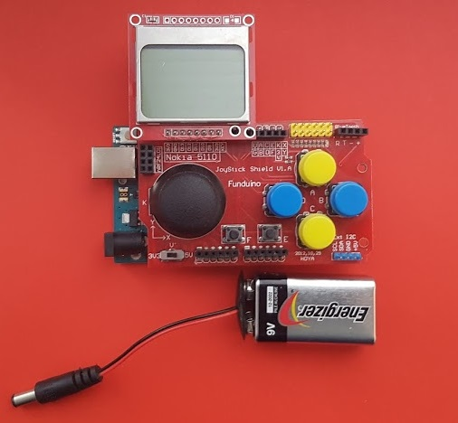

# Funduino Snake

### Beschreibung

Kleines Bastelprojekt für Programmieranfänger.

Benötigte Hardware:
* Arduino Uno Rev.3
* Nokia 5110 LCD Modul
* Funduino Joystick Shield
* 9V Batterie mit Adapter

### Links

* [ArduinoUno] - das Board
* [Nokia5110LCD] - Display
* [Libraries] - Arduino Bibliothek für das Display
* [FunduinoShield] - Funduino Gamepad

### Installation
Bibliothek zip File herunterladen und in der Arduino IDE hinzufügen und auswählen (sketch > add library), compilieren und hochladen.

### Bugs
Schlange hält an, Körper erscheint erst zu spät bei verlassen/erscheinen auf dem Bildschirms.

[ArduinoUno]: <https://www.reichelt.de/arduino-uno-rev-3-dip-variante-atmega328-usb-arduino-uno-dip-p154902.html>
[Nokia5110LCD]: <https://www.amazon.de/gp/product/B00MTH3AEK>
[Libraries]: <http://www.rinkydinkelectronics.com/library.php?id=48>
[FunduinoShield]: <https://www.amazon.de/gp/product/B00HTU5WW0> 